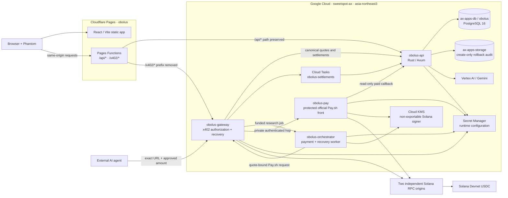

<h1 align="center">
   Obolus
</h1>

<p align="center">
  <a href="https://sudo-sail.github.io/obolus"><b>Read the write-up → sudo-sail.github.io/obolus</b></a><br/>
  <sub>Team SAIL project site — demo video, architecture and the technical report.</sub>
</p>

<p align="center">
  <a href="https://github.com/DanRo-AX/Obolus-GoogleCloudAI-Solana"></a>
  <a href="https://github.com/DanRo-AX/Obolus-GoogleCloudAI-Solana/actions/workflows/ci.yml"></a>
  
  
  
</p>

<p align="center">
  <sub><a href="docs/readme/README.ko.md">한국어</a></sub>
</p>

<p align="center">
  <strong>The internet, as a database. Priced by the document.</strong><br/>
  Obolus is a search service that reads documents people wrote themselves instead of the web,<br/>
  and pays for them one at a time. Seeded demo evidence opens for ₩5–₩25; an open-call answer<br/>
  inherits its call rate. The product policy is 90/10; the live rail is Devnet test USDC.
</p>

<h3 align="center"><a href="#getting-started"><ins>Getting started</ins></a></h3>

> **Live Devnet deployment (2026-08-20):** the public app runs on
> [Cloudflare Pages](https://obolus-9qi.pages.dev), while the API and payment
> services run separately on Google Cloud. The
> [finalist deck](https://obolus-9qi.pages.dev/pitch/?mode=final) and its
> [infrastructure](https://obolus-9qi.pages.dev/artifacts/finalist-evidence/infrastructure.json),
> [bounded Gemini loop](https://obolus-9qi.pages.dev/artifacts/finalist-evidence/autonomy.json), and
> [Solana Devnet](https://obolus-9qi.pages.dev/artifacts/finalist-evidence/devnet.json)
> evidence are public. This is a production-shaped Devnet system, not a Solana Mainnet launch.
>
> The ledger is now denominated in on-chain USDC atomic units. Balances, the
> open-calls board, earnings, receipts and the coverage index all read in USDC;
> the prepaid balance can be topped up on its own over x402, without buying a
> document first. Landing and chat still quote a document in won, because that
> is the unit the people on the shelves price in — see
> [the transaction unit](#the-transaction-unit-and-current-economics).

<p align="center">
  
</p>

## Features

<table>
<tr>
<td width="50%" valign="middle">

### Searches people, not the web

A general model fills the blank with the likeliest sentence. Obolus opens documents written by people who actually live there and pays each of them for what they wrote.

Searching and ranking are free. You are billed only for the documents that end up quoted.

</td>
<td width="50%">
  
</td>
</tr>
<tr>
<td width="50%" valign="middle">

### Misses turn into paid open calls

If nothing on the shelves fits, the answer is not "no results". Name what one answer is worth, and the question goes out as a paid call to people who would know.

- Eleven fields, each with its open count
- Sort by newest, popularity, pay, or fit
- Reward per answer reads in USDC, and the escrow decrements one answer at a time

</td>
<td width="50%">
  
</td>
</tr>
<tr>
<td width="50%" valign="middle">

### Payment over HTTP 402

HTTP already had [a reserved status code for this](https://www.rfc-editor.org/rfc/rfc9110.html#name-402-payment-required). The server answers `402` with an exact quote. The buyer reviews one aggregate preview and confirms once; Phantom appears only when the chosen prepaid balance needs a refill, not for every document.

A document is quoted in won, because that is what the people on the shelves price in. Everything that moves — the deposit, the per-document settlement, the payout, the refund — is USDC on Solana, and every balance in the app reads in USDC.

</td>
<td width="50%">
  
</td>
</tr>
<tr>
<td width="50%" valign="middle">

### Prepaid USDC you can top up on its own

Proving the wallet once opens a revocable prepaid session. From then on, opening documents and funding open calls draw down that balance, and the buyer is never asked to approve a payment per document.

Topping up is now its own rail: establish the prepaid session, ask the gateway for a whole-USDC quote, sign one exact transfer in Phantom, and the credit lands only after the gateway confirms the finalized transfer on two independent RPC providers. The browser never touches the internal deposit route, so it cannot credit itself.

- 1 / 5 / 10 / 25 USDC steps, capped at 1,000 USDC per top-up
- Idempotent by transaction signature: a retried top-up credits once
- Unused credit stays withdrawable to the verified wallet

</td>
<td width="50%">
  
</td>
</tr>
<tr>
<td width="50%" valign="middle">

### Wallet-only accounts

No email, no password, no name. Connecting reads your public address; entering signs one expiring message that cannot move funds or approve a transaction. An asker only ever sees a handle.

The x402 facilitator sponsors the Devnet network fee, so the buyer needs test
USDC but no SOL. The USDC faucet link is available before wallet connection.

</td>
<td width="50%">
  
</td>
</tr>
<tr>
<td width="50%" valign="middle">

### A live view of the machine, not a diagram of it

`/admin` is a running trace, not an architecture drawing. Every node reports its
own live counter — how many documents are indexed, how many memory entries have
landed, which PageRank seed and iteration count answered the last query, which
Gemini model reflected — and the terminal underneath streams the real Cloud Run
settlement events with their status codes and latencies.

Below the canvas: the memory stream as it fills, abstraction climbing from L0 to
L1, and the personalized PageRank graph for one specific query.

</td>
<td width="50%">
  
</td>
</tr>
<tr>
<td width="50%" valign="middle">

### Terms on the page, not in a policy

What you hand over and what is never taken sit side by side on the landing page rather than in a policy nobody opens.

Delete your shelf and every document leaves search immediately. Source text,
handles, and service-recoverable passage snapshots are destroyed; anonymized
financial audit rows and public-chain receipts remain.

</td>
<td width="50%">
  
</td>
</tr>
<tr>
<td width="50%" valign="middle">

### Public coverage for thin shelves

The public index shows aggregate demand and observed search misses without exposing the documents themselves. Reading across one field: how many questions are still open, how many answers they will take, the most anyone pays for one answer, and the money still on the table — that last figure in USDC.

A raw document count is a coverage signal, not proof that a question can be answered. What is public is where questions come back empty, and what somebody has already offered to fill it.

</td>
<td width="50%">
  
</td>
</tr>
<tr>
<td width="50%" valign="middle">

### English and Korean, both first-class

Not a translation layer bolted on. Korean gets its own typeface stack, weight, tracking, and `word-break: keep-all`, and the copy is rewritten per surface rather than translated sentence by sentence.

Switch in the sidebar footer. The choice survives a reload.

</td>
<td width="50%">
  
</td>
</tr>
</table>

**Also included**

- **[Obulus Full MCP](apps/obulus-mcp/README.md)**: all 29 buyer, contributor, memory, invoice, settlement and recovery operations for Codex or Claude, with exact Pay.sh handoff boundaries.
- **[Antigravity plugin](integrations/antigravity/openshelf/README.md)**: the original whole asker and contributor lifecycle as 24 `openshelf` MCP tools, plus the official Pay.sh MCP wallet behind a narrow handshake adapter.
- **Prepaid credit with recovery**: prove wallet ownership once, top up when low. A browser that loses the response reconciles against the server and retries only the handles that were never paid.
- **Open-call escrow**: a paid call reserves its full budget up front. Accepted answers release one unit each, and cancellation or account deletion returns the exact unused remainder as a payout claim.
- **A conduct ladder stated before signup**: two upheld voids remove documents from auto-match and hold new earnings for 14 days; a third blocks new answers. One dispute can restore a wrongly voided answer through admin review.
- **Public answers without impersonating people**: Gemini on Vertex AI can answer ordinary and current public-information questions with Google Search grounding, while curated official records retain their publisher, source URL, license, date, record ID, and content hash. These answers have no price, cannot be resold, earn no human authority, and never fill an open-call slot. Private human passages remain closed until paid.
- **A deliberately narrow contributor memory agent**: it reuses an existing paid answer only for an opted-in call that is 82%+ near-identical and still passes targeting, pricing, lock, and conduct rules. Everything else needs the person.
- **Receipts**: every chat, every purchased document, every transaction link, in one place.

---

## The transaction unit and current economics

| Term | Exact meaning in this build |
| --- | --- |
| Human document | One quality-checked, versioned final answer created from an accepted open-call response or an opted-in shelf-starter. Warm-up interview responses remain private and are not separately searchable or sold. |
| Search and open | Search is free and returns only handles, prices, and matching metadata. One paid open delivers the immutable passage version and citation bound to that query and receipt; it does not transfer the contributor's copyright. A later correction or lock does not change the delivered version. |
| Contributor price | An accepted open-call answer inherits that call's price per answer. For an opted-in shelf-starter, the contributor chooses a future price. The hosted Pay.sh rail currently accepts the fixed test bands ₩5, ₩10, ₩15, ₩25, ₩100, ₩300, ₩500, ₩700, ₩800, and ₩1,000. |
| Ledger denomination | The internal ledger is USDC atomic units (six decimals), serialized as JSON strings so a browser cannot lose precision. Balances, earnings, escrow, receipts and the coverage totals all read in USDC. The legacy `*_krw` columns are kept alongside as nullable history and are no longer the source of truth for money movement. A document's list price is still stored in won, and won is still what the landing page and the ask flow quote. |
| Browser approval | The UI shows the selected documents, the complete total, and the exact Devnet USDC amount once. Clicking **Open with prepaid balance** reserves only that quoted amount. Phantom signs only a buyer-chosen refill when credit is low; unused credit remains withdrawable and Obolus cannot pull more from the wallet. |
| Standalone top-up | Prepaid credit can also be added without buying anything. The browser asks the gateway for a whole-USDC quote (1–1,000 USDC), pays it over the same x402 exact scheme, and the gateway posts the verified transfer to an internal, `require_internal` deposit route only after two independent RPC providers agree the transfer to `OPENSHELF_BUNDLE_RECEIVER` is finalized. The deposit is idempotent by transaction signature, so a retry credits once. |
| Agent approval | The local buyer agent stores one exact intent and requires an interactive, one-time approval for its aggregate atomic amount. The model cannot substitute a URL, recipient, mint, network, or amount. |
| Conversion | Managed quotes use a fixed test rate of **1 USDC = ₩1,350**, not a live FX feed. Each document is rounded up independently to six-decimal USDC atomic units: `ceil(priceKrw × 1,000,000 / 1,350)`. |
| Current split | The product UI presents a 90% owner / 10% protocol policy with no checkout surcharge. The hosted Devnet Pay.sh endpoints currently send all but one atomic unit to the owner because their primary split must stay positive. A same-receipt on-chain 90/10 split is therefore still a pre-Mainnet gate, not a claimed commercial take rate. |
| Deletion and records | Seller account deletion removes the source text, handles, and service-recoverable passage snapshots; anonymized financial audit rows and public chain receipts remain. A paid version survives a correction or lock, but the service does not promise perpetual recovery after seller deletion and cannot recall copies already delivered to a buyer. |

The ₩ amounts and Devnet USDC are test economics. They demonstrate exact
quoting, settlement, recovery, payout, and refund behavior; they are not fiat,
redeemable value, or a live exchange-rate promise.

---

## How it works

```text
ask → search the shelves → rank by similarity → HIT or MISS
  HIT  → exact aggregate preview → reserve prepaid credit → pay N owners → cited answer + receipt
  MISS → optional free Gemini baseline (question only; never human evidence)
       → "Nobody has covered this yet. Want me to ask people?"
       → "How many people?"  → "What do you want to pay per answer?"
       → call posted → open-calls board
```

That branch is the only thing this project had to invent, so `src/pages/Chat.tsx`
implements it as a state machine that speaks exactly that dialogue. When enough
matching documents already exist the order inverts: no call is posted, and the
question goes straight to "here is the price, settle now?"

Matching, ranking, budget filtering, author deduplication, and the hit/miss
decision all run in the Rust service, using 768-dimensional hash embeddings, word
and character n-grams, entity anchors, trust, freshness, and topic-personalized
PageRank over curator-verified evidence edges. Paid, self-owned, inferred, and
raw UGC edges cannot buy authority. The search response carries handles and
prices, never a passage.

<details>
<summary><strong>The two settlement paths, in full</strong></summary>

**Agent path: the official Pay.sh gateway.** This is the default for autonomous agents.

1. Free search returns payment-safe handles and a query-scoped recovery token.
2. The agent checks the free recovery URL, then prepares one query-bound Pay.sh resource per unopened handle.
3. `pay curl` handles the HTTP 402/MPP exchange. The current Devnet Pay.sh endpoint sends all but one USDC atomic unit directly to the verified contributor wallet.
4. Rust re-validates the immutable quote, price band, asset, network, query, handle, and runtime recipient before returning the snapshot.
5. A lost response is recovered for free, and retries do not accrue twice.

This Devnet transport is not yet the same-receipt on-chain implementation of the product's 90/10 commercial policy. That split remains a pre-Mainnet gate.

**Browser path: Phantom and prepaid credit.** No companion process, no separate install.

1. Rust searches private documents and returns only safe handles and KRW prices.
2. It commits the exact handles, content hashes, beneficiary wallets, per-document atomic prices, total, mint, network, and expiry into one job.
3. It atomically reserves the job cost from verified prepaid credit. If credit is low, an unpaid refill resource returns x402 v2 `402 Payment Required` and Phantom tops up once. The same credit can be raised ahead of time from **My shelf** through the standalone top-up rail, which is the identical 402 exchange against a whole-USDC quote and no document.
4. A confirmed refill credits the ledger and funds the job. It does not reveal passages or accrue earnings. Credit is applied only after the gateway independently confirms the finalized transfer, and the browser never reaches the internal deposit route.
5. The server agent runs Pay.sh/MPP per document, and Rust releases only that exact paid snapshot, idempotently.
6. Rust reloads only server-proven opened passages, then Gemini on Vertex AI writes a cited synthesis. With no provider configured the UI shows an evidence-only result rather than inventing an answer.
7. A permanent partial failure restores the exact unpaid atomic remainder to prepaid credit.

No user private key, browser helper key, or SPL delegate ever reaches Rust, the
gateway, or Cloud Run. The service wallet signs through GCP KMS. See
[`docs/agent-payment-threat-model.md`](docs/agent-payment-threat-model.md).
Signer rotation intentionally fails readiness until every payout and refund
owned by the old wallet has drained; ten repeated failures also keep the new
worker unready rather than hiding the backlog.

</details>

## Deployed Devnet architecture

The `pages.dev` hostname is only the frontend edge. Obolus is not a browser-only application: Cloudflare Pages serves the React build and two narrow same-origin proxies, while four independent Cloud Run services own application logic, payment authorization, orchestration, and the protected Pay.sh boundary.



### What runs where

| Plane | Runtime | Responsibility and trust boundary |
| --- | --- | --- |
| Web edge | Cloudflare Pages project `obolus` | Serves fingerprinted Vite assets and SPA routes. No business ledger, user key, service signing key, or database lives here. |
| Same-origin proxy | Pages Functions | `/api/*` preserves the path to `obolus-api`; `/x402/*` removes only `/x402` before streaming to `obolus-gateway`. Dynamic responses are `private, no-store`. |
| Core API | Cloud Run `obolus-api`, identity `obolus-api-run` | Wallet sessions, profiles, search/ranking, immutable quotes, prepaid ledger, open-call escrow, receipts, disputes, Gemini policy, and internal settlement APIs. |
| Payment boundary | Cloud Run `obolus-gateway`, identity `obolus-gateway-run` | Validates exact x402/MPP economics, buffers paid content, requires independent finality, persists recovery fences, and records settlement through the API and Cloud Tasks. It never holds a user key. |
| Payment and recovery worker | Cloud Run `obolus-orchestrator`, identity `obolus-orchestrator-run` | Deterministically pays selected evidence through Pay.sh, reconciles uncertain attempts, and prepares KMS-backed contributor payouts and refunds. Despite the deployed service name, this worker does not call Gemini. |
| Protected Pay front | Cloud Run `obolus-pay`, identity `obolus-pay` | Runs the official Pay.sh collector with the GCP KMS feature. Requests without the private gateway token receive `404`; browsers and agents never receive that token or private origin. |
| Durable database | Cloud SQL `ax-apps-db`, database/user `obolus` | PostgreSQL 16 system of record for accounts, capabilities, quotes, payment fences, escrow, payout claims, and recovery state. Managed deployment rejects SQLite fallback. |
| Durable delivery | Cloud Tasks `obolus-settlements` | Retries idempotent gateway-to-ledger settlement after response or instance loss. |
| Independent audit | Cloud Storage `ax-apps-storage`, prefix `obolus/rollback-audit/**` | Create-only, temporarily held economic intent written before external payment or billed-model transport; the runtime cannot overwrite or delete it. |
| Signing | Cloud KMS key `solana-service-wallet` | Non-exportable Ed25519 service signer. Workloads receive narrow sign permission, never a service-account key or raw private key. |
| Runtime configuration | Secret Manager | Injects the database URL, RPC origins, and service-to-service credentials into only the workloads that need them. Secrets are not committed or passed through Pages. |
| AI | Gemini on Vertex AI inside `obolus-api` | Call 1 maps the authenticated question to bounded search metadata. Rust executes retrieval; call 2 observes only aggregate HIT/PARTIAL/MISS state and selects one reviewed, non-spending next-action function. Paid synthesis is a separate post-settlement call. AI output cannot become priced human inventory or authority. |
| Chain | Solana Devnet USDC | Real test-token funding, owner payout, and refund. Release requires matching finalized evidence from two independent RPC origins. [Devnet tokens are test assets, not real value](https://solana.com/docs/references/clusters#devnet). |

The deployment reuses the shared `ax-apps-db` and `ax-apps-storage` resources under the existing `ax-apps-*` convention. Obolus-specific services and revisions carry `initiative=kr2` (plus the observed inventory labels), and each runtime has a dedicated, keyless service account. Data and IAM remain workload-scoped: the API has access only to the `obolus` database and registered storage prefix, and no service-account key is created. Cloud Build produces separate images in Artifact Registry before an explicitly named revision receives traffic.

### Request and recovery contracts

1. **Login and free search:** the browser calls `/api/*` on the Pages hostname. The proxy streams the same path to Rust, so the HttpOnly `SameSite=Lax` wallet session stays first-party.
2. **Browser funding:** Pages sends `/x402/*` to the gateway. Phantom signs only the exact Devnet USDC requirement after the quote is re-read from Rust; the compute budget is raised before wallet signing. A second tab or uncertain response follows recovery instead of paying again.
3. **Durable settlement:** the gateway verifies the exact signed template and independent finality, enqueues Cloud Tasks, and writes the same idempotent settlement to Rust. Paid content stays buffered until the ledger accepts it.
4. **Agent purchase:** the model sees free metadata tools only. After explicit approval of the exact aggregate amount, the local Pay MCP or hosted orchestrator uses a query-bound URL; arbitrary URLs, headers, wallets, and payment credentials are outside the model-facing tool surface.
5. **Pay.sh delivery:** the gateway alone can reach the protected Pay front. The callback can construct a quoted response but cannot credit itself; the gateway verifies the receipt and byte-identical finalized transaction before Rust releases the snapshot.
6. **Payout and refund:** the orchestrator signs through KMS, checks the exact transaction through two RPC origins, and completes one durable payout claim. Ambiguity leaves the claim fenced for reconciliation rather than signing again.
7. **Bounded AI loop and synthesis:** Gemini first calls one metadata-search function. After Rust executes and ranks it, Gemini makes a second function call to choose among reviewed next-action proposals; the server rejects actions inconsistent with the observed coverage. Economic proposals stop for explicit user approval. Only later, after settlement, does a separate synthesis call receive paid evidence.

### Current deployment and evidence

Verified live on 2026-08-20: `obolus-api` and `obolus-gateway` both serve 100% of
traffic from the revision built for the current `main`, and the Pages build
deployed at that hostname is the same revision. The prepaid top-up route answers
a whole-USDC quote at `POST /x402/api/v1/prepaid/top-ups`.

| Surface | Current deployed entrypoint |
| --- | --- |
| App and same-origin API | [`https://obolus-9qi.pages.dev`](https://obolus-9qi.pages.dev) |
| Finalist presentation | [`/pitch/?mode=final`](https://obolus-9qi.pages.dev/pitch/?mode=final) |
| Rust API upstream | `https://obolus-api-amjeodet3q-du.a.run.app` |
| x402 gateway upstream | `https://obolus-gateway-amjeodet3q-du.a.run.app` |
| Payment and recovery worker | `https://obolus-orchestrator-amjeodet3q-du.a.run.app` (service-authenticated) |
| Protected Pay front | `https://obolus-pay-amjeodet3q-du.a.run.app` (private-token boundary) |

Cloudflare currently has no custom domain attached, so `obolus-9qi.pages.dev` is the deployed Pages hostname. Browser code should use relative `/api` and `/x402` routes, not the upstream Cloud Run origins. The orchestrator and Pay front URLs document service placement, not public client entrypoints.

The published [infrastructure](https://obolus-9qi.pages.dev/artifacts/finalist-evidence/infrastructure.json), [bounded Gemini loop](https://obolus-9qi.pages.dev/artifacts/finalist-evidence/autonomy.json), and [Devnet settlement](https://obolus-9qi.pages.dev/artifacts/finalist-evidence/devnet.json) files are separate capability records. At this source revision the published autonomy file still predates the two-stage evidence contract, so it must not support a current live claim until the API is promoted and all three artifacts are regenerated and correlated by `npm run pitch:verify-live`. The autonomy gate requires two provider-backed function calls around deterministic retrieval plus a matching Cloud Run application log and serving revision; its three trace labels are auditable roles, not three independent agents or A2A. The Devnet artifact proves a typed Open Call funding → payout → refund lifecycle, not the separate HIT purchase and cited-synthesis path. These secret-free records do not substitute for a consented live inventory, independent Vertex audit logs, Mainnet security, legal review, or customer validation.

[`architecture.html`](architecture.html) remains the detailed application/data-model and ERD view. [`docs/DEPLOYMENT.ko.md`](docs/DEPLOYMENT.ko.md) is the canonical release sequence; [`deploy/cloud-run/README.md`](deploy/cloud-run/README.md) holds the deeper GCP boundary, migration, and recovery contracts; [`deploy/cloudflare-pages/README.md`](deploy/cloudflare-pages/README.md) holds the Pages build and proxy contract.

---

## Tech stack

<p>
  <kbd>React&nbsp;19</kbd> &nbsp; <kbd>TypeScript&nbsp;5.9</kbd> &nbsp; <kbd>Vite&nbsp;8</kbd> &nbsp; <kbd>Tailwind&nbsp;v4</kbd> &nbsp; <kbd>React&nbsp;Router&nbsp;7</kbd> &nbsp; <kbd>three.js</kbd> &nbsp; <kbd>React&nbsp;Flow</kbd> &nbsp; <kbd>Framer&nbsp;Motion</kbd> &nbsp;
  <kbd>Rust&nbsp;1.89&nbsp;/&nbsp;Axum</kbd> &nbsp; <kbd>Cloud SQL&nbsp;/&nbsp;PostgreSQL</kbd> &nbsp;
  <kbd>x402&nbsp;v2&nbsp;—&nbsp;exact&nbsp;/&nbsp;SVM</kbd> &nbsp; <kbd>Solana&nbsp;Devnet</kbd> &nbsp; <kbd>USDC</kbd> &nbsp; <kbd>Phantom</kbd> &nbsp;
  <kbd>Pay.sh&nbsp;+&nbsp;MPP</kbd> &nbsp; <kbd>GCP&nbsp;KMS</kbd> &nbsp; <kbd>Cloud&nbsp;Run</kbd> &nbsp; <kbd>Gemini&nbsp;on&nbsp;Vertex&nbsp;AI</kbd>
</p>

---

## Getting started

Prerequisites: Node.js 24, npm, and Rust 1.89. Google Cloud CLI is needed only
for the optional local Vertex AI path or for operators running GCP checks.

```bash
npm ci
npm --prefix payment-gateway ci
npm --prefix agent-orchestrator ci

cp .env.example .env             # at minimum, replace OPENSHELF_DEFAULT_RECEIVER

npm run dev:stack                # frontend, Rust API, and the x402 gateway together
```

`dev:stack` is a three-process developer stack. It uses local SQLite at
`backend/openshelf.db`; it does **not** start Cloud SQL, the payment/recovery
orchestrator, or the protected Pay front. Free search and the deterministic UI
flow work locally. For Gemini, set `GOOGLE_CLOUD_PROJECT`, enable Vertex AI, and
run `gcloud auth application-default login`. For paid work, replace every
relevant `YOUR_...` payment/RPC placeholder rather than treating it as a
default, or run the isolated Pay.sh sandbox E2E below. The deployed topology is
operated through the linked Cloud Run and Pages runbooks, not `dev:stack`.

| Process | Port | Started by |
| --- | --- | --- |
| Frontend (Vite) | `4319` | `npm run dev:stack` |
| Rust API (Axum) | `8787` | `npm run dev:stack` |
| x402 gateway | `1402` | `npm run dev:stack` |
| Pay.sh gateway (sandbox) | `3402` | `npm run pay:gateway:sandbox` |

Optional:

```bash
npm run pay:gateway:sandbox      # the official Pay.sh gateway, local sandbox
npm run pay:sandbox:e2e          # full local Rust + Pay.sh + gateway recovery contract
npm run x402:devnet:smoke        # funded-wallet settlement verification
```

The frontend's paid branch is enabled by default, but the three-process stack is
not a complete hosted-payment replica. Configure the external payment services
or use the isolated Pay.sh sandbox E2E before testing paid research. Set
`VITE_X402_ENABLED=false` only for the labelled sandbox-ledger path, or
`VITE_BACKEND_ENABLED=false` for the fully static fallback.

### Agents (Antigravity and plain MCP)

The repository-root `.agents/mcp_config.json` uses the standalone, buyer-only
[`apps/obulus-local-agent`](apps/obulus-local-agent) path. It requires no Obolus
account, email, profile, Phantom session, or server-held signing key. Search
sends only a minimized question and coarse filters; query capabilities remain
in a mode-`0600` local file, and real signatures are delegated to the separate
Pay.sh process. The model-facing payment MCP exposes no arbitrary URL or
headers: it can execute only a locally stored intent that the user approved in
an interactive terminal.

```bash
export OBULUS_PAY_ACCOUNT=research           # required named local Pay.sh account
npm run local-agent:doctor
npm run local-agent:tools
npm run local-agent:mcp
# after the MCP prepares intent_... in another terminal
npm run local-agent:approve -- intent_...
```

This is local key custody and data minimization, not on-chain anonymity. The
public payer address and transaction receipt necessarily remain visible during
Solana settlement. The app README documents the complete trust boundary.

The fuller Antigravity plugin remains available for the contributor lifecycle:

```bash
agy plugin install ./integrations/antigravity/openshelf
npm run agent:doctor
agy
```

Use `/mcp` to confirm both `openshelf` and `pay` are connected. Free search and
AI baselines need no Pay account. Before the first paid action, create or select
a locally protected named Pay account, and set `OPENSHELF_PAY_ACCOUNT=NAME` when
it should differ from the Pay default. **The plugin requires explicit approval
for the exact aggregate Devnet amount before it invokes Pay.**

The same service runs without Antigravity:

```bash
npm run agent:tools                          # list all 24 commands
npm run agent:tools -- ask_people            # one exact input schema
npm run agent:call -- ask_people --json \
  '{"question":"What do people living in Paris actually eat on weeknights?","requestedDocuments":3}'
```

Paid buyer commands return an exact URL and amount for the separate Pay MCP;
they never receive a private key. Managed contributor-account commands are
deferred until the agent can complete the same wallet challenge/SIWX proof as
the browser. The legacy email `auth login` command remains test-only behind
`OPENSHELF_EMAIL_PASSWORD_AUTH_ENABLED=true` and is not part of the launch path.

See [`integrations/antigravity/openshelf/README.md`](integrations/antigravity/openshelf/README.md),
[`docs/ACCOUNT-LINKING.md`](docs/ACCOUNT-LINKING.md), [`pay/PAY.md`](pay/PAY.md),
and [`docs/PAY-SH.md`](docs/PAY-SH.md) for Cloud Run + GCP KMS deployment.

---

## Building and testing

```bash
npm run build                    # TypeScript + Vite build, then stage the pitch deck
npm run lint                     # oxlint
npm run check:all                # every workspace: build, lint, typecheck, tests, clippy
npm run pitch:verify-live        # require the published deck and all three live evidence gates
```

`check:all` needs a Rust toolchain (`rust-toolchain.toml` pins 1.89.0) because it
runs `cargo test` and `cargo clippy -D warnings` against `backend/`. CI runs the
frontend, Pay front boundary, agent-orchestrator, payment-gateway, and backend
jobs separately. A successful `main` run records the tested SHA and deploys
Pages only when it is compatible with the latest Cloud Run success marker.
Stateful Cloud Run changes require explicit schema/backlog/rollback review and
a manually dispatched keyless exact-revision workflow; failed tests and pull
requests never receive deployment credentials. See
[`.github/workflows/ci.yml`](.github/workflows/ci.yml),
[`.github/workflows/deploy.yml`](.github/workflows/deploy.yml),
[`.github/workflows/deploy-cloud-run.yml`](.github/workflows/deploy-cloud-run.yml), and the
[deployment runbook](docs/DEPLOYMENT.ko.md).

The 2026-08-20 local full-regression baseline is **435/435 normal tests**:
frontend 25, Pages proxy 3, Antigravity MCP 14, local agent 24, standalone
Obulus MCP 7, evidence tooling 13, gateway 102, orchestrator 53, Rust API 186,
and the Solana settlement program 8. Build, bundle verification, typecheck, lint, and
Clippy also pass, and all four npm production dependency audits report zero
vulnerabilities. Gateway mutation testing kills 200/200 scoped mutants. The
full Rust mutation baseline is deliberately not called a pass: 197 of 437 were
caught, 221 survived, and 19 were unviable. RustSec and survivor reduction
remain Mainnet gates. See [`docs/MUTATION-TESTING.md`](docs/MUTATION-TESTING.md)
and the [engineering readiness record](docs/FINALIST-ENGINEERING-READINESS.ko.md).

---

## Screens

| Route | Screen | What it does |
| --- | --- | --- |
| `/` | **Ask** | The front door. Ask, and SHELF searches the shelves; a miss becomes an open call. |
| `/chat/:id` | Chat | One question's thread, including the hit/miss dialogue and the settlement preview. |
| `/dashboard` | **Open calls** | The answerer's board. Calls arrive with a price per answer; pick one, answer, get paid. |
| `/memory` | **My shelf** | Everything you have answered, what it earned, the evidence account, and the prepaid USDC top-up control. The headline figure is total USDC held — prepaid balance plus accrued earnings, added as exact atomic units. It also shows the Phantom wallet's own Devnet USDC balance, read from Solana and labelled as separate from Obolus credit. |
| `/archive` | My questions | Question history, the documents each one paid for, total spent, and which receipts are on-chain. |
| `/transactions` | Receipts | Every settlement and payout, with its transaction link. |
| `/coverage` | Thin shelves | Live demand: open questions per field, answers still wanted, and the USDC still on the table. |
| `/answer/:orderId` | Answer | One screen, one question, a few warm-ups first. |
| `/onboarding` | Set-up | Handle, bands, fields, payout wallet, and the three-strike conduct ladder. |
| `/whitepaper` | The argument | The long-form case for the thing. |
| `/admin` | Admin Test | The system observatory: the live request-to-settlement canvas, the memory stream, abstraction growth, personalized PageRank, and the read-only operations tables. `/admin/disputes`, `/admin/operations` and `/admin/data-pipeline` all redirect here. |
| `/login` `/terms` `/privacy` | | Wallet sign-in and legal. |

---

## Repository structure

| Path | What lives there |
| --- | --- |
| `src/` | The React app: pages, components, `i18n/`, and the `data/` fixtures the landing page labels as illustrations. |
| `cloudflare/` + `functions/` | Pages proxy implementation/tests and the `/api/*`, `/x402/*` Functions entrypoints. |
| `backend/` | The Rust/Axum service: search, ranking, ledger, escrow, disputes, sessions. [`backend/README.md`](backend/README.md) states the exact boundary. |
| `payment-gateway/` | The x402 v2 gateway: quotes, verify/settle delegation, payout and escrow workers. |
| `agent-orchestrator/` | The deterministic Cloud Run payment/recovery worker that pays Pay.sh challenges, reconciles ambiguity, and prepares payouts/refunds. It contains no Gemini/Vertex planning loop. |
| `pay/` | Pay.sh paywall definitions, Dockerfile, and the Cloud Build + GCP KMS deployment. |
| `apps/obulus-local-agent/` | Accountless buyer MCP: local capabilities, privacy guard, exact quote validation, and Pay.sh handoff without Phantom. |
| `apps/obulus-mcp/` | Full 29-tool MCP: buyer, contributor, memory, invoice, settlement recovery, earnings, and account operations. |
| `integrations/antigravity/openshelf/` | The plugin: 24 MCP tools, skills, and the Pay handshake adapter. |
| `deploy/cloudflare-pages/` + `deploy/cloud-run/` | Edge and GCP deployment contracts, promotion checks, and rollback runbooks. |
| `artifacts/` + `docs/pitch-final-assets/` | Captured product evidence for the finalist deck, with a manifest stating which shots are usable and which are held back because their state is empty. |
| `docs/` | Threat model, account linking, Pay.sh deployment, code review, ranking notes. |
| `architecture.html` | Detailed application, data-model, and ERD view. This README summarizes the deployment; the linked evidence and deploy runbooks hold observed state and operator contracts. |

---

## Project status

This is a deployed, production-shaped **Devnet** system. It is not a Mainnet or
paid-customer launch.

### Verified now

- Cloudflare Pages serves the public app and same-origin proxies; four Cloud Run services run at explicit 100% revisions with dedicated identities.
- The Rust API uses the real `ax-apps-db/obolus` PostgreSQL database. Cloud Tasks, the create-only `ax-apps-storage` audit prefix, Secret Manager, and the KMS signer are attached to their scoped workloads.
- Wallet challenge/SIWX is the launch authentication path. Sessions are server-issued HttpOnly cookies, client-supplied identities are rejected, and email/password remains test-only behind a disabled flag.
- Deterministic code owns search/ranking, immutable quotes, the database-backed custodial escrow ledger, settlement fences, recovery, payouts, refunds, and AI approval boundaries. In the API's bounded two-call loop, Gemini plans metadata, observes Rust retrieval, and selects one non-spending proposal before user approval; it separately synthesizes only paid evidence afterward. This is not A2A or a multi-agent claim.
- A hosted Devnet evidence run records real test-USDC funding, owner payout, exact remainder refund, matching finality from two independent RPC providers, and zero duplicate settlement.
- The ledger is denominated in USDC atomic units end to end. Open calls are funded from the prepaid USDC balance rather than an internal won pot, there is no signup credit, and the standalone top-up route credits only after independently confirmed finality, idempotent by transaction signature.

### Known gaps in this revision

- The landing page and the ask flow still quote a document in won while every balance, board and receipt reads in USDC. That split is a product decision to make, not a rendering bug, but the two conventions are visible on adjacent screens.
- The landing hero fails closed rather than degrading: `src/components/ui/liquid-shader.tsx` constructs a `THREE.WebGLRenderer` without a guard, and there is no error boundary in `src/`, so a browser with no usable WebGL renders `/` blank. Every other route survives.
- `scripts/mock-backend.mjs` predates the USDC work, so `npm run demo:record` and anything captured against the mock still show the pre-USDC interface.

### Deliberately not claimed

- Mainnet custody, commercial settlement, passkeys, A2A/AP2 interoperability, or an externally audited Solana escrow program.
- Email/password or social login at launch; wallet-only authentication is the current product decision.
- Representative market validation. Product examples and fixtures are demonstrations, not customer outcome evidence.

### Gates before paid customers or Mainnet

1. Run a narrow customer PoC with 20–50 real questions and a 30–100-person expert panel, measuring answer quality, time saved, willingness to pay, and contributor retention independently.
2. Replace the demo-price assumptions with measured PoC unit economics, then bind the chosen split to one exact on-chain quote and receipt. See [`docs/UNIT-ECONOMICS.md`](docs/UNIT-ECONOMICS.md); accounting-safe treasury, refund, dispute, tax, sanctions, KYC/AML, jurisdiction, buyer-use rights, and concrete retention decisions remain gates.
3. Establish Cloud Monitoring SLOs and alerts for error budget, queue age, reconciliation backlog, Vertex fallback, and RPC disagreement; rehearse incident response.
4. Complete Cloud SQL HA/private-IP and restore drills, KMS rotation, external rate-limit/Cloud Armor validation, and a branded custom domain before material traffic.
5. Reduce the 221 Rust mutation survivors, run RustSec in CI, and complete an independent security review of identity, money movement, and recovery boundaries.

Further reading: [`SCENARIO-AUDIT.md`](SCENARIO-AUDIT.md) for browser-verified
scenarios and prioritized gaps, [`docs/CODE-REVIEW.md`](docs/CODE-REVIEW.md) for
the security review, and [`BRIEF.md`](BRIEF.md) for the product brief.

---

## License

No `LICENSE` file is committed yet, so default copyright applies: all rights
reserved. Open an issue if you need terms for a specific use.
